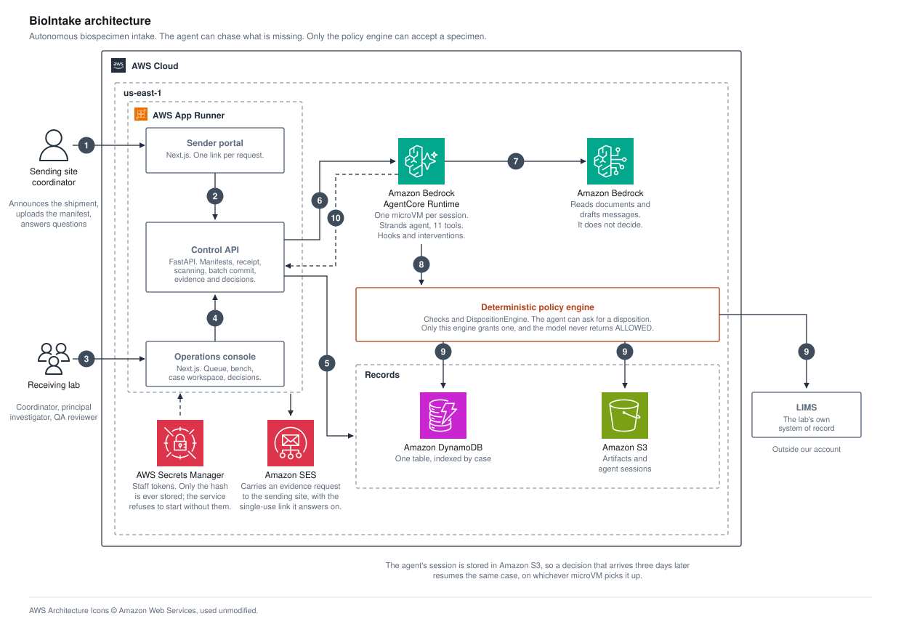

# BioIntake

A box of research samples arrives at a biobank. Before any tube goes in a freezer, seven records
have to agree: the label, the shipping manifest, the study protocol, the participant's consent, the
transport temperature log, the chain of custody, and the lab's own record system.

Today a coordinator checks all of that by hand. Then they email the sending site about whatever is
missing, and wait.

BioIntake does the checking and the chasing. It accepts a specimen only when every required check
passes. It writes to the sending site about the ones it cannot settle. It interrupts a person only
where the protocol says a person must decide.

| | |
|---|---|
| Console | https://megh2ru4xg.us-east-1.awsapprunner.com |
| Control API | https://b2tda2pwss.us-east-1.awsapprunner.com/health |

Built on Strands Agents and Amazon Bedrock AgentCore. All data is synthetic. This is
research-operations software, not a clinical or regulatory system.

## Architecture



1. A **sending site coordinator** opens a link scoped to one request. No account, no install.
2. The **sender portal** posts the announcement and the manifest. The manifest is checked against
   the study before the courier is booked. A wrong specimen type costs an email to fix here. It
   costs a destroyed specimen to fix on arrival.
3. The box arrives. The **receiving lab** works it on the bench: condition, refrigerant, logger
   files, and a scan of every tube against the manifest.
4. The **console** commits the staging batch. Nothing reaches inventory before that. A partial
   receipt has to be chosen, not fallen into.
5. The **control API** writes down what it was told. This is the path most intake takes, and no
   model touches it.
6. The API invokes the **agent runtime** under an execution lease, so one case is never worked
   twice at once.
7. The agent asks **the model** to read the messy documents and draft the query to the site. It is
   never asked whether a specimen is acceptable.
8. Seven checks per specimen go to the **policy engine**, which decides.
9. What the engine decided gets written down: the disposition and its audit trail to DynamoDB,
   evidence to S3, the accepted specimen to the lab's LIMS.
10. Missing evidence goes back to the site as one message. Anything the protocol reserves for a
    person raises an interrupt, and the case waits until someone with the authority answers.

Nothing is silently corrected. If the manifest says `BX-2O7` with a letter O and the tube says
`BX-207` with a digit zero, the bench records both and says which is which, in words.

## The one idea

The agent can read messy documents, decide what to look at next, put several problems into one
message to a verified contact, and re-run the checks that new evidence affects.

It cannot accept a specimen. `PolicyDecision.ALLOWED` is produced in exactly one place, from stored
check results. So a model that follows a prompt injection perfectly still cannot accept a sample
whose checks do not pass. The example shipment contains a real injection, and a test drives the
agent with a model policy written to obey it.

## Try it

`example-shipment/` holds one shipment's paperwork, numbered in the order the screens ask for it.
Its README says which file goes in which field. It contains the four problems a real box arrives
with: a manifest typo, a cold-chain excursion, two participants whose consent is out of date, and an
accession that belongs to a record somebody archived.

Working through the screens by hand is the only path there is; the console has no shortcut button.
`tests/integration/test_bench_only_path.py` walks the same route and checks where it lands. Twelve specimens come out as **7 accepted,
1 quarantined, 1 raised for a person, 3 waiting on the site**.

To run it locally:

```bash
make install
make check                 # ruff, mypy, and the test suite
make api-dev               # control API on :8000, in-memory, offline model
cd web && npm install && npm run dev
```

`make api-dev` prints a sign-in token for each member of the lab's staff.

## What it proves

- **A specimen cannot be accepted on bad evidence.** Ten thousand random check-status vectors never
  produce `ALLOWED` unless every required check passes.
- **Human authority is real.** A temperature exception needs a principal investigator. A role sent
  in a client payload is ignored, because authority comes from trusted server context.
- **Identity is never overwritten.** An accession collision can only lead to quarantine. The
  colliding historical record is left alone.
- **A live model stays inside the bounds.** Three runs on Claude Sonnet 5 reached the same
  dispositions by visibly different routes, and every invariant held. See
  [`docs/phase2b-results.md`](docs/phase2b-results.md).
- **Evidence recovery closes the loop.** A shipment that arrives without its paperwork gets asked
  for it, and the answer re-decides only the checks it affects.

## Layout

```
src/biointake/    api · agent · domain (frozen models, policy, disposition engine) ·
                  services · repositories (memory, DynamoDB) · storage (local, S3)
web/              Next.js console and sender portal
example-shipment/ one shipment's paperwork, to work through by hand
deploy/           Dockerfiles for App Runner, and the AgentCore runtime project
scripts/          cloud_build.py · deploy_apprunner.py · eval_live_model.py · e2e_flow.py
docs/             architecture · threat model · decisions/ · research/ · screenshots/
tests/            unit · integration · hardening · agent · api · invariant fuzz
```

## Security

[`docs/threat-model.md`](docs/threat-model.md) says what BioIntake defends against, points at the
code for each control, and has a section on what it does not defend against.

Prompt injection is the main threat, because every input worth reading was written by someone
outside the lab. The control that carries the weight is that the model cannot accept anything. The
rest limit the damage.

## Licence

MIT. See [LICENSE](LICENSE).
